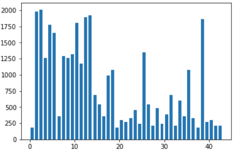
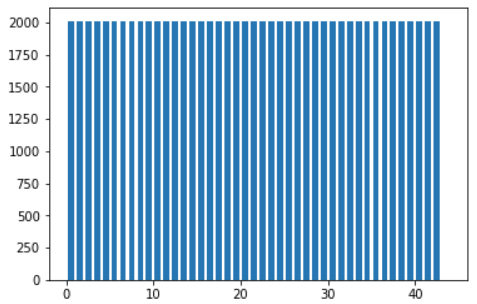
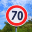

# **Traffic Sign Classification** 

## Setup

### Download the Data

Download the data from
[here](https://s3-us-west-1.amazonaws.com/udacity-selfdrivingcar/traffic-signs-data.zip) and store
the datasets in a `traffic-sign-detection/data`.

### Download Dependencies

Install the project dependencies.

```bash
$ pipenv install
```

Spawn a shell in the pipenv virtual environment. This will give you access to all of the dependencies installed above.

```bash
$ pipenv shell
```

---

## Writeup

**Build a Traffic Sign Recognition Project**

The goals / steps of this project are the following:
* Load the data set (see below for links to the project data set)
* Explore, summarize and visualize the data set
* Design, train and test a model architecture
* Use the model to make predictions on new images
* Analyze the softmax probabilities of the new images
* Summarize the results with a written report

### Writeup / README

#### 1. Provide a Writeup / README that includes all the rubric points and how you addressed each one. You can submit your writeup as markdown or pdf. You can use this template as a guide for writing the report. The submission includes the project code.

This README serves as my writeup for this project. My code is [here](https://github.com/shanekelly/traffic-sign-classification/blob/master/src/traffic_sign_classifier.ipynb).

### Data Set Summary & Exploration

#### 1. Provide a basic summary of the data set. In the code, the analysis should be done using python, numpy and/or pandas methods rather than hardcoding results manually.

I used the pandas library to calculate summary statistics of the traffic
signs data set:

* The size of training set is 34799.
* The size of the validation set is 4410.
* The size of test set is 12630.
* The shape of a traffic sign image is 32px by 32px.
* The number of unique classes/labels in the data set is 43.

#### 2. Include an exploratory visualization of the dataset.

Here is an exploratory visualization of the data set. It is a histogram showing how many images there are of each type of sign in the training dataset.



### Design and Test a Model Architecture

#### 1. Describe how you preprocessed the image data. What techniques were chosen and why did you choose these techniques? Consider including images showing the output of each preprocessing technique. Pre-processing refers to techniques such as converting to grayscale, normalization, etc. (OPTIONAL: As described in the "Stand Out Suggestions" part of the rubric, if you generated additional data for training, describe why you decided to generate additional data, how you generated the data, and provide example images of the additional data. Then describe the characteristics of the augmented training set like number of images in the set, number of images for each class, etc.)

1. Convert images to grayscale to reduce information input.
2. Normalize images to move the mean of the data to be closer to zero.
3. Augment the existing training data such that there are at least 2000 images of each type of traffic sign.
 * I created the augmented training images by randomly translating, scaling, perspective-warping, and brightening existing images.
 * Here is the sign count distribution after my training set augmentation: 

#### 2. Describe what your final model architecture looks like including model type, layers, layer sizes, connectivity, etc.) Consider including a diagram and/or table describing the final model.

I used a LeNet model with a dropout layer added. My final model consisted of the following layers:

| Layer               		| Description	         		     			| 
|:---------------------:|:------------------------------:| 
| Convolution 5x5     	 | 32x32x1 -> 28x28x6 	           |
| RELU					             |	28x28x6 -> 28x28x6             |
| Max Pool	2x2      	   | 28x28x6 -> 14x14x6		           |
| Convolution 5x5	      | 14x14x6 -> 10x10x16	           |
| RELU					             |	10x10x16 -> 10x10x16           |
| Max Pool 2x2    	     | 10x10x16 -> 5x5x16		           |
| Convolution 5x5	      | 5x5x16   -> 1x1x400	           |
| RELU					             |	1x1x400  ->	1x1x400            |
| Flatten               | 5x5x16 -> 400 & 1x1x400 -> 400 |
| Concatenate           | 400 & 400 -> 800               |
| Dropout               | 800 -> 800                     |
| Fully Connected       | 800 -> 43                      |

#### 3. Describe how you trained your model. The discussion can include the type of optimizer, the batch size, number of epochs and any hyperparameters such as learning rate.

To train the model, I first used some features suggested by the Udacity course: an Adam optimizer, a cross entropy function to define loss, and 10 training epochs to keep training time low (though, I believe more epochs would lead to slightly higher model accuracy). I also modified a few of the hyperparameters through trial and error. By changing some hyperparameters and keeping what gave me the best results I also ended up with: a training rate of 0.009, a dropout rate of 0.5, and a batch size of 100.

#### 4. Describe the approach taken for finding a solution and getting the validation set accuracy to be at least 0.93. Include in the discussion the results on the training, validation and test sets and where in the code these were calculated. Your approach may have been an iterative process, in which case, outline the steps you took to get to the final solution and why you chose those steps. Perhaps your solution involved an already well known implementation or architecture. In this case, discuss why you think the architecture is suitable for the current problem.

My model had a final accuracy of 93.9%.

I took an iterative approach to developing my final model. In my approach, I:
1. Used a LeNet model on the raw images given. This led to ~83% accuracy.
2. Did basic preprocessing of the images. This led to ~87% accuracy.
3. Augmented the training dataset. This led to ~91% accuracy.
4. Added a dropout layer to the LeNet model. This led to ~94% accuracy.

### Test a Model on New Images

#### 1. Choose five German traffic signs found on the web and provide them in the report. For each image, discuss what quality or qualities might be difficult to classify.

Here are six German traffic signs that I found on the web:

     

The first five images might be difficult to classify because they are more like cartoon drawings of the signs, rather than real-world images. The last sign might be difficult to classify because of the viewing angle and lighting.

#### 2. Discuss the model's predictions on these new traffic signs and compare the results to predicting on the test set. At a minimum, discuss what the predictions were, the accuracy on these new predictions, and compare the accuracy to the accuracy on the test set (OPTIONAL: Discuss the results in more detail as described in the "Stand Out Suggestions" part of the rubric).

Here are the results of the prediction:

| Image			         | Prediction	   			      	| 
|:----------------:|:-----------------------:| 
| Speed Limit (30)	| Road Work   					      	| 
| Priority Road 			| Pedestrians 					       |
| Yield					       | Ahead Only			      					|
| Stop	      		    | End of Truck No Passing	|
| General Caution		| End of No Passing      	|
| Speed Limit (70)	| End of No Passing	      |

The model was able to correctly guess 0 of the 5 traffic signs, which gives an accuracy of 0%. This is much worse than the accuracy of 94% from earlier. I think this shows that my model does not extrapolate to drawings of the signs, only real-world images.

#### 3. Describe how certain the model is when predicting on each of the five new images by looking at the softmax probabilities for each prediction. Provide the top 5 softmax probabilities for each image along with the sign type of each probability. (OPTIONAL: as described in the "Stand Out Suggestions" part of the rubric, visualizations can also be provided such as bar charts)

The code for making predictions on my final model is located in the 11th cell of the Ipython notebook.

For the first image, the model is relatively sure that this is a stop sign (probability of 0.6), and the image does contain a stop sign. The top five soft max probabilities were

First Image:

Probabilities 0.10098808, 0.05516459, 0.0526412 , 0.04690201, and 0.04367175

for sign types of IDs

24,  4,  2, 30,  and 3.

Second Image:

Probabilities 0.02770888, 0.02709951, 0.02706924, 0.02683168, and 0.02675658


for sign types of IDs

24,  4,  2, 30,  3

Third Image:

Probabilities 0.0835975 , 0.05567694, 0.04744596, 0.04557654, and 0.04222185

for sign types of IDs

30, 24, 22, 38, 32

Fourth Image:

Probabilities 0.13266209, 0.06849746, 0.04579978, 0.04458379, and 0.04266969

for sign types of IDs

24, 23,  0, 35, 22

Fifth Image:

Probabilities 0.06907281, 0.05207001, 0.04950347, 0.04548184, and 0.03722019

for sign types of IDs

24,  2, 30,  4,  3

Sixth Image:

Probabilities 0.07369509, 0.06944858, 0.05594585, 0.04664502, and 0.03904153

for sign types of IDs

24,  3,  2, 20, 34
